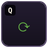
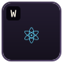
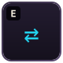
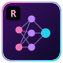

<p align="center">
  
</p>

<p align="center">
  <a href="https://www.linkedin.com/in/sajjad-fatehi-403a9a187/"></a>
  <a href="https://medium.com/@sajjadfatehy"></a>
  <a href="mailto:sajjadfatehy@gmail.com"></a>
  
</p>

<br/>

<p align="center">
  
</p>


### 🎮 Skill Build <sub>— click an ability, then ⬆ level up</sub>

<table>
<tr>
<td align="center" valign="top" width="25%">
<details>
<summary><br/><sub><b>Event Loop</b></sub></summary>
<br/>
<sub>◆◇◇◇ · <b>LVL 1</b></sub><br/><sub>Handles 1k concurrent sockets without blocking.</sub>
<details><summary><sub>⬆ level up</sub></summary>
<sub>◆◆◇◇ · <b>LVL 2</b></sub><br/><sub>Streams &amp; backpressure mastered. Memory stays flat.</sub>
<details><summary><sub>⬆ level up</sub></summary>
<sub>◆◆◆◇ · <b>LVL 3</b></sub><br/><sub>Cluster + worker threads. CPU-bound work offloaded.</sub>
<details><summary><sub>⬆ level up</sub></summary>
<sub>◆◆◆◆ · <b>MAX</b></sub><br/><sub>Event-loop lag profiled to zero. p99 &lt; 50ms.</sub>
</details>
</details>
</details>
</details>
</td>
<td align="center" valign="top" width="25%">
<details>
<summary><br/><sub><b>Virtual DOM</b></sub></summary>
<br/>
<sub>◆◇◇◇ · <b>LVL 1</b></sub><br/><sub>Summons components that render.</sub>
<details><summary><sub>⬆ level up</sub></summary>
<sub>◆◆◇◇ · <b>LVL 2</b></sub><br/><sub>Hooks &amp; memo. No wasted re-renders.</sub>
<details><summary><sub>⬆ level up</sub></summary>
<sub>◆◆◆◇ · <b>LVL 3</b></sub><br/><sub>Code-splitting, Suspense, virtualized lists.</sub>
<details><summary><sub>⬆ level up</sub></summary>
<sub>◆◆◆◆ · <b>MAX</b></sub><br/><sub>60fps UIs even on potato devices.</sub>
</details>
</details>
</details>
</details>
</td>
<td align="center" valign="top" width="25%">
<details>
<summary><br/><sub><b>Peer Link</b></sub></summary>
<br/>
<sub>◆◇◇◇ · <b>LVL 1</b></sub><br/><sub>Establishes a P2P call. ICE, STUN, TURN.</sub>
<details><summary><sub>⬆ level up</sub></summary>
<sub>◆◆◇◇ · <b>LVL 2</b></sub><br/><sub>SFU architecture, simulcast, bandwidth estimation.</sub>
<details><summary><sub>⬆ level up</sub></summary>
<sub>◆◆◆◇ · <b>LVL 3</b></sub><br/><sub>Survives 20% packet loss. NACK, FEC, jitter buffers.</sub>
<details><summary><sub>⬆ level up</sub></summary>
<sub>◆◆◆◆ · <b>MAX</b></sub><br/><sub>Thousands of concurrent live rooms.</sub>
</details>
</details>
</details>
</details>
</td>
<td align="center" valign="top" width="25%">
<details>
<summary><br/><sub><b>AI Overdrive</b></sub></summary>
<br/>
<sub>◆◇◇ · <b>LVL 1</b></sub><br/><sub><i>Ultimate.</i> Summons AI pair-programmers. Coding speed +50%.</sub>
<details><summary><sub>⬆ level up</sub></summary>
<sub>◆◆◇ · <b>LVL 2</b></sub><br/><sub>Agents with tools &amp; MCP. Automates entire workflows.</sub>
<details><summary><sub>⬆ level up</sub></summary>
<sub>◆◆◆ · <b>MAX</b></sub><br/><sub>Ships LLM features to prod: RAG, evals, guardrails. ♥</sub>
</details>
</details>
</details>
</td>
</tr>
</table>

### 🎒 Inventory <sub>— click an item to inspect</sub>

<table>
<tr>
<td align="center" valign="top">
<details>
<summary><br/><sub><b>Docker</b></sub></summary>
<br/><sub><i>Passive · Works On My Machine</i></sub><br/><sub>Ships the machine too.</sub>
</details>
</td>
<td align="center" valign="top">
<details>
<summary><br/><sub><b>Redis</b></sub></summary>
<br/><sub><i>Active · Cache Hit</i></sub><br/><sub>Latency −90%. Cooldown: TTL.</sub>
</details>
</td>
<td align="center" valign="top">
<details>
<summary><br/><sub><b>Postgres</b></sub></summary>
<br/><sub><i>Passive · ACID Armor</i></sub><br/><sub>Your data never lies.</sub>
</details>
</td>
<td align="center" valign="top">
<details>
<summary><br/><sub><b>RabbitMQ</b></sub></summary>
<br/><sub><i>Passive · Queue Up</i></sub><br/><sub>Messages are never lost, only delayed.</sub>
</details>
</td>
<td align="center" valign="top">
<details>
<summary><br/><sub><b>Nginx</b></sub></summary>
<br/><sub><i>Aura · Reverse Proxy</i></sub><br/><sub>Allies behind it take 50% less traffic.</sub>
</details>
</td>
<td align="center" valign="top">
<details>
<summary><br/><sub><b>Elastic</b></sub></summary>
<br/><sub><i>Active · True Sight</i></sub><br/><sub>Finds any log in the haystack.</sub>
</details>
</td>
</tr>
</table>

### 📜 Quest Log

```diff
+ [DONE]    Ship real-time audio/video to thousands of users
+ [DONE]    Tame the Node.js event loop under production load
+ [DONE]    Unlock ultimate: AI Overdrive — AI agents in the daily workflow
! [ACTIVE]  Build AI-powered features: LLMs, agents, tool use, RAG   ████████░░ 80%
! [ACTIVE]  Go deep on AI engineering: evals, MCP, fine-tuning   █████░░░░░ 55%
! [ACTIVE]  Performance deep-dive: profiling, GC, memory, p99  ███████░░░ 70%
- [LOCKED]  Write the WebRTC article I keep promising myself   (requires: free weekend)
```

### 💬 Ask Me About

> **Node.js** internals · **React** perf · **WebRTC** (ICE, SFU, simulcast, “why is my video frozen”) · scaling real-time backends · **AI agents & LLM tooling** 🤖

<details>
<summary><b>📦 Full stash</b> <i>(everything else in the bank)</i></summary>
<br/>

<p align="center">
  <br/>
  <br/>
  
</p>

</details>

### 📊 Match History

<p align="center">
  
  
</p>

<p align="center">
  
</p>

<!--
<p align="center">
  
</p>
-->

### ✍️ Patch Notes <sub>(latest from Medium)</sub>

<!-- BLOG-POST-LIST:START -->
- 🚧 _No patch notes yet — the first article is still in the quest log. Stay tuned._
<!-- BLOG-POST-LIST:END -->

<p align="center">
  
</p>
