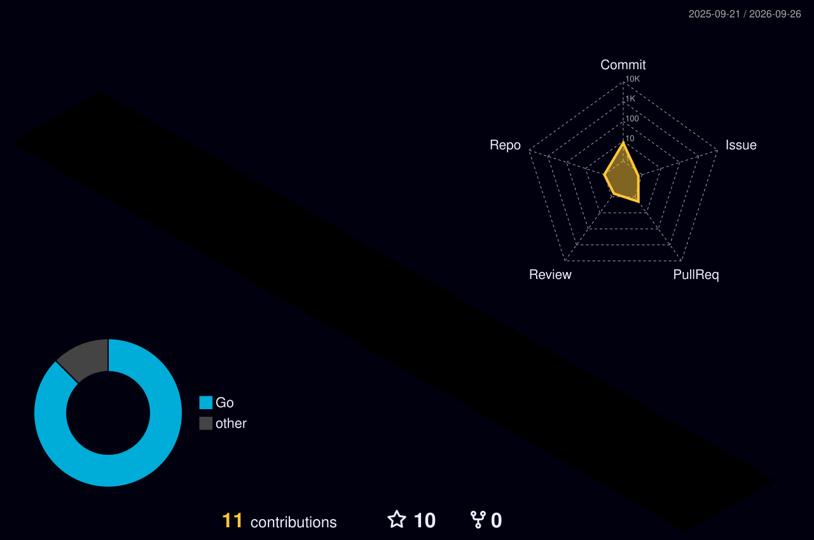

<p align="center">
  
</p>

<p align="center">
  <a href="https://www.linkedin.com/in/sajjad-fatehi-403a9a187/"></a>
  <a href="https://medium.com/@sajjadfatehy"></a>
  <a href="mailto:sajjadfatehy@gmail.com"></a>
  <a href="https://skyroom.online"></a>
  
</p>

<br/>

<p align="center">
  
</p>

### 📜 Quest Log

```diff
+ [DONE]    Ship real-time audio/video to thousands of users   @ SkyRoom
+ [DONE]    Tame the Node.js event loop under production load
+ [DONE]    Unlock ultimate: AI Overdrive — AI agents in the daily workflow
! [ACTIVE]  Build AI-powered features: LLMs, agents, tool use, RAG   ████████░░ 80%
! [ACTIVE]  Master Go — goroutines, channels, pprof            ██████░░░░ 60%
! [ACTIVE]  Performance deep-dive: profiling, GC, memory, p99  ███████░░░ 70%
- [LOCKED]  Write the WebRTC article I keep promising myself   (requires: free weekend)
```

### 💬 Ask Me About

> **Node.js** internals · **React** perf · **WebRTC** (ICE, SFU, simulcast, “why is my video frozen”) · scaling real-time backends · **AI agents & LLM tooling** 🤖

<details>
<summary><b>🎒 Full inventory</b> <i>(click to open the stash)</i></summary>
<br/>

<p align="center">
  <br/>
  <br/>
  
</p>

</details>

### 📊 Match History

<p align="center">
  
  
</p>

<p align="center">
  
</p>

<p align="center">
  
</p>

### ✍️ Patch Notes <sub>(latest from Medium)</sub>

<!-- BLOG-POST-LIST:START -->
<!-- BLOG-POST-LIST:END -->

<p align="center">
  
</p>
